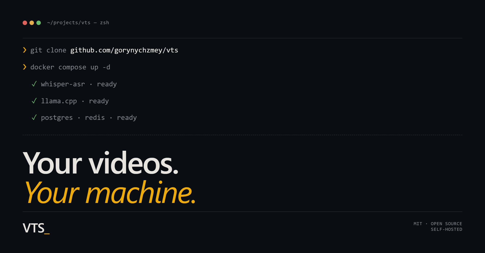

# vts



Self-hosted pipeline that turns long-form video into structured transcripts
and summaries. Uses Whisper for transcription and a local LLM for
summarization, with silence-aware audio segmentation and backpressure-managed
parallel processing so it runs on modest hardware.

Give it a YouTube URL or upload a video file — it downloads, segments,
transcribes, summarizes, and notifies. Runs entirely on your own machine.
Installable as a PWA on Android and desktop, with system share-sheet
integration and push notifications when long-running tasks finish.

> **Status:** working personal project, used in production by the author.
> The internal API is stable enough to depend on but not formally versioned —
> see [PROJECT_RULES.md](PROJECT_RULES.md) for release conventions.

---

## Why this exists

There are plenty of tools that transcribe a video and plenty that summarize a
transcript. Most online services either send your data to a third party or
charge per minute. vts stitches together open-source pieces (yt-dlp, Whisper,
llama.cpp/Ollama) into a small web service that runs on your hardware, with
sensible defaults for queueing, restartability, and progress reporting.

What you get:

- A web UI for submitting tasks (URL or file upload), watching progress live
  via SSE, and reading the resulting transcript and summary.
- A worker that downloads, segments, transcribes, and summarizes — restart-safe,
  with backpressure and a single "heavy slot" so a small machine doesn't
  thrash.
- An installable PWA: appears in the Android share sheet, supports push
  notifications when a task finishes.
- A JSONL metrics stream so you can see exactly how each pipeline stage
  performed (RTF, tokens/s, redundancy, mismatches).

## Quick start (local, with Docker)

You need Docker (or Podman with the docker CLI plugin) and a `.gguf` model
file for the LLM stage.

```bash
git clone https://github.com/gorynychzmey/vts.git
cd vts
cp .env.example .env

# Pick an LLM backend. The shipped prompts in ./prompts/ are tuned for
# Qwen 3.5 9B (via Ollama). Other instruct models work too — see
# docs/LLM_BACKENDS.md for the trade-offs and switch instructions.

# Path A — Ollama (recommended, matches the shipped prompt tuning):
docker compose --profile llm-ollama --profile asr-whisper up -d
docker compose exec ollama ollama pull qwen3.5:9b

# Path B — llama.cpp with a local .gguf file:
mkdir -p models
# Download a quantized model into ./models. Example: Qwen2.5-7B-Instruct Q4_K_M
# from https://huggingface.co/Qwen/Qwen2.5-7B-Instruct-GGUF (≈4.6 GB).
# (download Qwen2.5-7B-Instruct-Q4_K_M.gguf into ./models/)
docker compose --profile llm-llamacpp --profile asr-whisper up -d

# Wait ~30s for healthchecks to settle, then open:
open http://localhost:8080
```

For real deployments, vts authenticates via Google OAuth (see
[Authentication](#authentication) below and
[docs/AUTH.md](docs/AUTH.md) for the full picture). For local development
without a Google client, set `VTS_OAUTH_ENABLED=false` and pass
`X-Forwarded-User: <your-email>` on each request — vts auto-creates the
user on first call.

For production deployments using podman + systemd, see
[docs/INITIAL_DEPLOYMENT.md](docs/INITIAL_DEPLOYMENT.md).

## Authentication

vts handles authentication itself — Google OAuth 2.0 for browsers and MCP
clients (claude.ai / ChatGPT / Claude Desktop), all behind the same Google
client. There is no separate auth proxy.

Minimal setup:

1. **Create an OAuth 2.0 Client ID** in
   [GCP Console](https://console.cloud.google.com/apis/credentials) (type
   "Web application"). Add **both** redirect URIs:
   - `https://<your-domain>/auth/callback`     (web UI)
   - `https://<your-domain>/mcp/auth/callback` (MCP)

2. **Set env vars** (or `config.yaml`):

   ```bash
   VTS_OAUTH_ENABLED=true
   VTS_OAUTH_CLIENT_ID=<from GCP>
   VTS_OAUTH_CLIENT_SECRET=<from GCP>
   VTS_PUBLIC_BASE_URL=https://<your-domain>
   VTS_OAUTH_ALLOWED_DOMAINS=your-domain.tld
   ```

3. **Reverse proxy**: route `Host(your-domain)` straight to vts on
   port 8080.

The session HMAC key is auto-generated on first start at
`/opt/vts/state/session_secret`; no manual key management needed for
single-host deployments.

For the full picture — request resolver, MCP flow, session lifetime,
admin impersonation, HA setup, security model, dev mode, **personal API
tokens** for scripted clients — see [**docs/AUTH.md**](docs/AUTH.md).

MCP tools exposed once authenticated:

- `submit_video`, `list_tasks`, `get_status`, `get_transcript`,
  `get_summary`, `wait_for_task` — see
  [docs/AUTH.md](docs/AUTH.md#mcp-tools) for the full signatures.

## Stack

- **Python 3.14**, FastAPI, async SQLAlchemy.
- **Postgres** for state, **Redis** (or Valkey/KeyDB) for queue + pub/sub.
- **yt-dlp** + **ffmpeg** for ingest and segmentation.
- **Whisper ASR webservice** for transcription.
- **llama.cpp server** for summarization (Ollama and others also work — see
  [docs/LLM_BACKENDS.md](docs/LLM_BACKENDS.md)).
- **Podman + systemd** for production runtime; **Docker Compose** for local.

## Configuration

- [`.env.example`](.env.example) — variables consumed by `docker compose`.
- [`config.yaml`](config.yaml) — the application config; mounted read-only
  into the container at `/opt/vts/config/config.yaml`.

Most settings live in `config.yaml`; environment variables override them with
the `VTS_` prefix (e.g. `VTS_LLM_MODEL` overrides `services.llm.model`). See
[docs/ARCHITECTURE.md](docs/ARCHITECTURE.md) for the full set.

## LLM backends

vts is built against the llama.cpp HTTP server, which means it uses a few
endpoints beyond the OpenAI standard (`/props`, `/tokenize`, `/detokenize`).
This affects which alternative backends work:

- **Ollama** — what the author runs in production. The shipped prompts in
  `./prompts/` are tuned for Qwen 3.5 9B (`qwen3.5:9b`). Needs a local
  tokenizer file and a static `n_ctx`; see [docs/LLM_BACKENDS.md](docs/LLM_BACKENDS.md).
- **llama.cpp** — the API vts is implemented against; works with no extra
  setup once you have a `.gguf` model.
- **vLLM, OpenAI, Anthropic, anything OpenAI-compatible via LiteLLM** — same
  caveats as Ollama.

## Documentation

- [docs/ARCHITECTURE.md](docs/ARCHITECTURE.md) — full system reference: data
  model, runtime, config keys, metrics schema, API surface, build system.
- [docs/INITIAL_DEPLOYMENT.md](docs/INITIAL_DEPLOYMENT.md) — production
  deployment with podman + systemd.
- [docs/PROCESSING_CONTRACT.md](docs/PROCESSING_CONTRACT.md) — pipeline stage
  contract.
- [docs/SPEC_COMPLIANCE.md](docs/SPEC_COMPLIANCE.md) — spec coverage and gaps.
- [docs/LLM_BACKENDS.md](docs/LLM_BACKENDS.md) — LLM backend compatibility.
- [PROJECT_RULES.md](PROJECT_RULES.md) — release and version-bump conventions.
- [CONTRIBUTING.md](CONTRIBUTING.md) — how to contribute, dev setup, code style.
- [SECURITY.md](SECURITY.md) — security policy and reporting.

## How this project is built

vts is developed with heavy use of AI assistants (Claude Code, Codex). The
conventions, agent entry points, and managed automation files live alongside
the code on purpose — they document not just what the project does but also
how it is maintained. See [AGENTS.md](AGENTS.md), [CLAUDE.md](CLAUDE.md),
[CODEX.md](CODEX.md), [PROJECT_RULES.md](PROJECT_RULES.md) and the
`.ai/managed/` tree if you're curious about the workflow.

## License

[MIT](LICENSE) © Viktor Vostrikov
