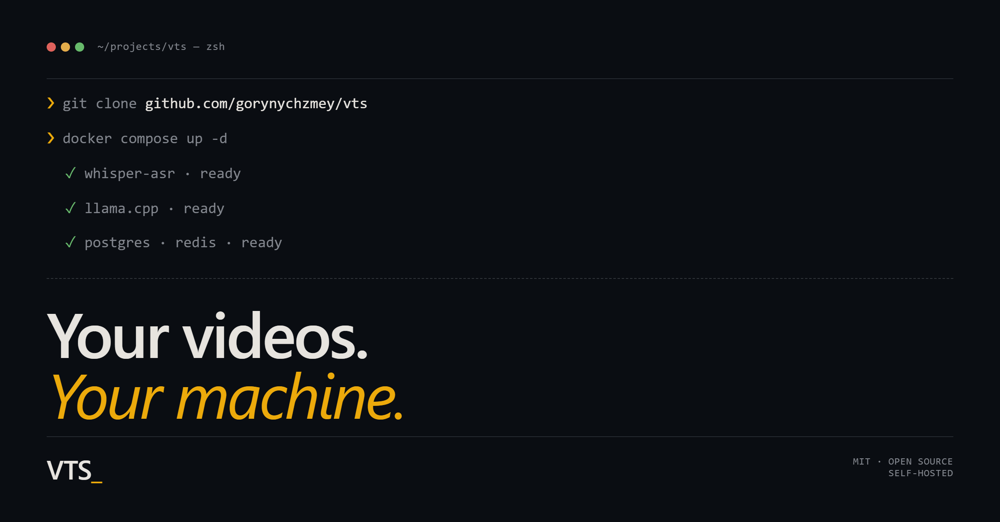

# vts



Self-hosted pipeline that turns video and audio into a **searchable private
knowledge base**. Whisper transcribes, a local LLM summarizes, and everything
that comes out stays queryable: recordings outlive the jobs that produced them,
and any passage can be found again by meaning — in any language — and opened at
the exact second it was said.

Give it a YouTube URL, upload a file, or share from your phone. It downloads,
segments, transcribes, diarizes, summarizes, indexes, and notifies. Nothing
leaves your machine: transcription, embeddings and search all run against your
own services.

Retrieval, not answers. Search returns the passages themselves with their
timecodes and speakers, and **returns nothing when nothing is relevant enough**
rather than the closest available text. Your own AI client does the reasoning —
over MCP, against evidence it can verify.

> **Status:** working personal project, used in production by the author.
> The internal API is stable enough to depend on but not formally versioned —
> see [PROJECT_RULES.md](PROJECT_RULES.md) for release conventions.

---

## Why this exists

There are plenty of tools that transcribe a video and plenty that summarize a
transcript. Almost all of them treat the result as **output**: a file you
download, read once, and lose track of. And most online services either send
your recordings to a third party or charge per minute.

vts treats the result as a **knowledge base**. A meeting you transcribed six
months ago is still there, still searchable by what was said in it, and one
click from the moment someone said it. It stitches together open-source pieces
(yt-dlp, Whisper, llama.cpp/Ollama, pgvector) into a small web service that runs
on your hardware.

Three properties are deliberate, because they are what make the archive worth
keeping:

1. **Recordings outlive their jobs.** A processing task is one way to create or
   update a recording, not the thing itself. Deleting or archiving a job does
   not take the knowledge with it.
2. **Search that admits it does not know.** Below a calibrated relevance
   threshold you get an empty result, not the nearest passages. A confident
   answer assembled from irrelevant fragments is worse than no answer.
3. **Everything traceable to the audio.** Every retrieved passage carries its
   recording, speakers and timecodes, and links straight to that second of the
   recording — so any claim can be checked against what was actually said.

What you get:

- A web UI for submitting tasks (URL or file upload, including a set of files
  joined into one recording), watching progress live via SSE, and reading the
  resulting transcript and summary.
- A **Library** of recordings that survive their tasks, with duration,
  language and what each one still has on disk.
- **Semantic search across the whole corpus** (Postgres + pgvector, no separate
  vector database), with a configurable relevance threshold and cross-language
  retrieval — an English question finds the Russian passage that answers it.
- The **same search as an MCP tool**, so an external AI client retrieves
  evidence directly, with identical threshold and rules. VTS stays a retrieval
  server; the reasoning belongs to the client.
- A worker that downloads, segments, transcribes, and summarizes — restart-safe,
  with backpressure and a single "heavy slot" so a small machine doesn't
  thrash.
- Optional **speaker diarization** with a persistent speaker registry, so
  recurring voices are recognised across recordings and named once.
- **Custom prompts**: pick per task which prompts run over the transcript;
  each produces its own result. Reusable option **presets** save the choice.
- **Delivery**: push finished results to an external system (e.g. a wiki)
  through pluggable adapters, with retries and per-task delivery status.
- An installable PWA: appears in the Android share sheet, supports push
  notifications when a task finishes.
- A JSONL metrics stream so you can see exactly how each pipeline stage
  performed (RTF, tokens/s, redundancy, mismatches).

## Quick start (local, with Docker)

You need Docker (or Podman with the docker CLI plugin) and a `.gguf` model
file for the LLM stage.

```bash
git clone https://github.com/gorynychzmey/vts.git
cd vts
cp .env.example .env

# Pick an LLM backend. The shipped prompts in ./prompts/ are tuned for
# Qwen 3.6 35B served via an OpenAI-compatible proxy such as LiteLLM. Other
# instruct models work too — see docs/LLM_BACKENDS.md for the trade-offs,
# the LiteLLM setup, and switch instructions.

# Path A — llama.cpp with a local .gguf file (simplest to run locally: vts
# reads context size and tokenization straight from the server):
mkdir -p models
# Download a quantized model into ./models. Example: Qwen2.5-7B-Instruct Q4_K_M
# from https://huggingface.co/Qwen/Qwen2.5-7B-Instruct-GGUF (≈4.6 GB).
docker compose --profile llm-llamacpp --profile asr-whisper up -d

# Path B — Ollama (needs a local tokenizer.json and a manual summary.n_ctx;
# see docs/LLM_BACKENDS.md):
docker compose --profile llm-ollama --profile asr-whisper up -d
docker compose exec ollama ollama pull qwen3.5:9b

# Wait ~30s for healthchecks to settle, then open:
open http://localhost:8080
```

For real deployments, vts authenticates via Google OAuth (see
[Authentication](#authentication) below and
[docs/AUTH.md](docs/AUTH.md) for the full picture). For local development
without a Google client, set `VTS_OAUTH_ENABLED=false` and pass
`X-Forwarded-User: <your-email>` on each request — vts auto-creates the
user on first call.

For production deployments using podman + systemd, see
[docs/INITIAL_DEPLOYMENT.md](docs/INITIAL_DEPLOYMENT.md).

## Authentication

vts handles authentication itself — Google OAuth 2.0 for browsers and MCP
clients (claude.ai / ChatGPT / Claude Desktop), all behind the same Google
client. There is no separate auth proxy.

Minimal setup:

1. **Create an OAuth 2.0 Client ID** in
   [GCP Console](https://console.cloud.google.com/apis/credentials) (type
   "Web application"). Add **both** redirect URIs:
   - `https://<your-domain>/auth/callback`     (web UI)
   - `https://<your-domain>/mcp/auth/callback` (MCP)

2. **Set env vars** (or `config.yaml`):

   ```bash
   VTS_OAUTH_ENABLED=true
   VTS_OAUTH_CLIENT_ID=<from GCP>
   VTS_OAUTH_CLIENT_SECRET=<from GCP>
   VTS_PUBLIC_BASE_URL=https://<your-domain>
   VTS_OAUTH_ALLOWED_DOMAINS=your-domain.tld
   ```

3. **Reverse proxy**: route `Host(your-domain)` straight to vts on
   port 8080.

The session HMAC key is auto-generated on first start at
`/opt/vts/state/session_secret`; no manual key management needed for
single-host deployments.

For the full picture — request resolver, MCP flow, session lifetime,
admin impersonation, HA setup, security model, dev mode, **personal API
tokens** for scripted clients — see [**docs/AUTH.md**](docs/AUTH.md).

MCP tools exposed once authenticated:

- `submit_video`, `list_tasks`, `get_status`, `get_transcript`,
  `get_summary`, `wait_for_task` — see
  [docs/AUTH.md](docs/AUTH.md#mcp-tools) for the full signatures.

## Search and MCP

Every recording is split into passages on speaker turns and timecodes — not on
a fixed token count — embedded, and indexed in Postgres. Re-processing a
recording replaces its passages, so a transcript corrected after speakers are
resolved does not leave stale text behind.

**The threshold is the feature.** Search returns nothing when nothing clears it:

```
GET /api/search?q=what+did+we+decide+about+pricing
{
  "query": "...",
  "threshold": 0.45,
  "hits": [
    {
      "recording_id": "...", "source_task_id": "...",
      "title": "Team sync", "text": "...",
      "start_sec": 5014.5, "end_sec": 5061.0,
      "speakers": ["SPEAKER_00"], "score": 0.556
    }
  ]
}
```

An empty `hits` means "the recordings do not cover this", which is a real
answer. The threshold comes back with the results so a caller can say that
rather than guess. It is configurable (`services.search_threshold`), and the
default is calibrated rather than picked — see
[docs/ARCHITECTURE.md](docs/ARCHITECTURE.md#corpus-search-threshold) for the
measurements and how to re-calibrate on your own corpus.

`source_task_id` plus `start_sec` build a deep link —
`/player/{task}?t={start_sec}` opens the recording at that passage with it
highlighted. That is what makes a citation checkable in one click.

**The same search is an MCP tool** (`search_transcripts`), with identical
threshold and rules — both go through one function, so they cannot drift apart.
It returns evidence, never a composed answer: passages, positions, speakers and
scores for your client to reason over. Point Claude, or any MCP client, at your
own archive and it cites your recordings instead of inventing an answer.

## Stack

- **Python 3.14**, FastAPI, async SQLAlchemy.
- **Postgres + pgvector** for state and the semantic index — no separate vector
  database. Embeddings are stored as `halfvec` with an HNSW cosine index.
- **Redis** (or Valkey/KeyDB) for queue + pub/sub.
- **yt-dlp** + **ffmpeg** for ingest and segmentation.
- **Whisper ASR webservice** for transcription.
- **pyannote.audio** for optional speaker diarization (own container, weights
  vendored at build time — nothing is fetched at runtime).
- **llama.cpp server** for summarization (Ollama and others also work — see
  [docs/LLM_BACKENDS.md](docs/LLM_BACKENDS.md)).
- **A multilingual embedding model** for search, served through the same
  OpenAI-compatible gateway as the chat model — no extra service to run. The
  default is `bge-m3` (1024 dimensions).
- **Podman + systemd** for production runtime; **Docker Compose** for local.

## Configuration

- [`.env.example`](.env.example) — variables consumed by `docker compose`.
- [`config.yaml`](config.yaml) — the application config; mounted read-only
  into the container at `/opt/vts/config/config.yaml`.

Most settings live in `config.yaml`; environment variables override them with
the `VTS_` prefix (e.g. `VTS_LLM_MODEL` overrides `services.llm.model`). See
[docs/ARCHITECTURE.md](docs/ARCHITECTURE.md) for the full set.

## LLM backends

vts is built against the llama.cpp HTTP server, which means it uses a few
endpoints beyond the OpenAI standard (`/props`, `/tokenize`, `/detokenize`).
This affects which alternative backends work:

- **LiteLLM proxy** — the recommended setup: the shipped prompts in
  `./prompts/` are tuned for Qwen 3.6 35B (`qwen3.6:35b`) served this way.
  Also the way to reach hosted models. Needs a local tokenizer file and a
  static `n_ctx`; see [docs/LLM_BACKENDS.md](docs/LLM_BACKENDS.md).
- **llama.cpp** — the API vts is implemented against; works with no extra
  setup once you have a `.gguf` model.
- **Ollama, vLLM, OpenAI, Anthropic** — work, with the same tokenizer and
  `n_ctx` caveats as LiteLLM.

## Documentation

- [docs/ARCHITECTURE.md](docs/ARCHITECTURE.md) — full system reference: data
  model, runtime, config keys, metrics schema, API surface, build system.
- [docs/INITIAL_DEPLOYMENT.md](docs/INITIAL_DEPLOYMENT.md) — production
  deployment with podman + systemd.
- [docs/PROCESSING_CONTRACT.md](docs/PROCESSING_CONTRACT.md) — pipeline stage
  contract.
- [docs/SPEC_COMPLIANCE.md](docs/SPEC_COMPLIANCE.md) — spec coverage and gaps.
- [docs/LLM_BACKENDS.md](docs/LLM_BACKENDS.md) — LLM backend compatibility.
- [docs/API.md](docs/API.md) — programmatic access: OpenAPI spec at `/openapi.json`,
  Swagger UI at `/docs`, and setup notes for ChatGPT Custom Actions / curl.
- [PROJECT_RULES.md](PROJECT_RULES.md) — release and version-bump conventions.
- [CONTRIBUTING.md](CONTRIBUTING.md) — how to contribute, dev setup, code style.
- [SECURITY.md](SECURITY.md) — security policy and reporting.

## How this project is built

vts is developed with heavy use of AI assistants (Claude Code, Codex). The
conventions, agent entry points, and managed automation files live alongside
the code on purpose — they document not just what the project does but also
how it is maintained. See [AGENTS.md](AGENTS.md), [CLAUDE.md](CLAUDE.md),
[CODEX.md](CODEX.md), [PROJECT_RULES.md](PROJECT_RULES.md) and the
`.ai/managed/` tree if you're curious about the workflow.

## License

[MIT](LICENSE) © Viktor Vostrikov

### Third-party models

Speaker diarization uses [pyannote.audio](https://github.com/pyannote/pyannote-audio)
(MIT) with the `speaker-diarization-community-1` models by Hervé Bredin and the
pyannote authors, licensed under
[CC BY 4.0](https://creativecommons.org/licenses/by/4.0/). The models run in the
`diarization` container; their weights are vendored into the image at build time
(verified by sha256) and are never fetched at runtime.
