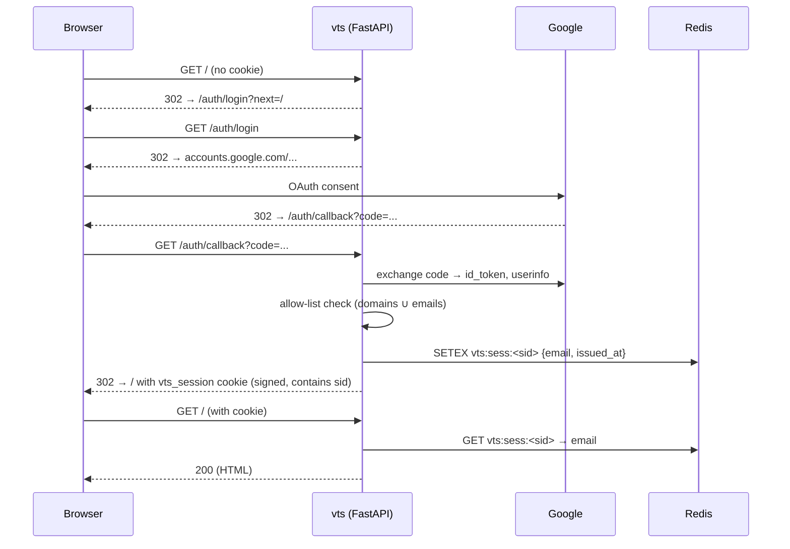
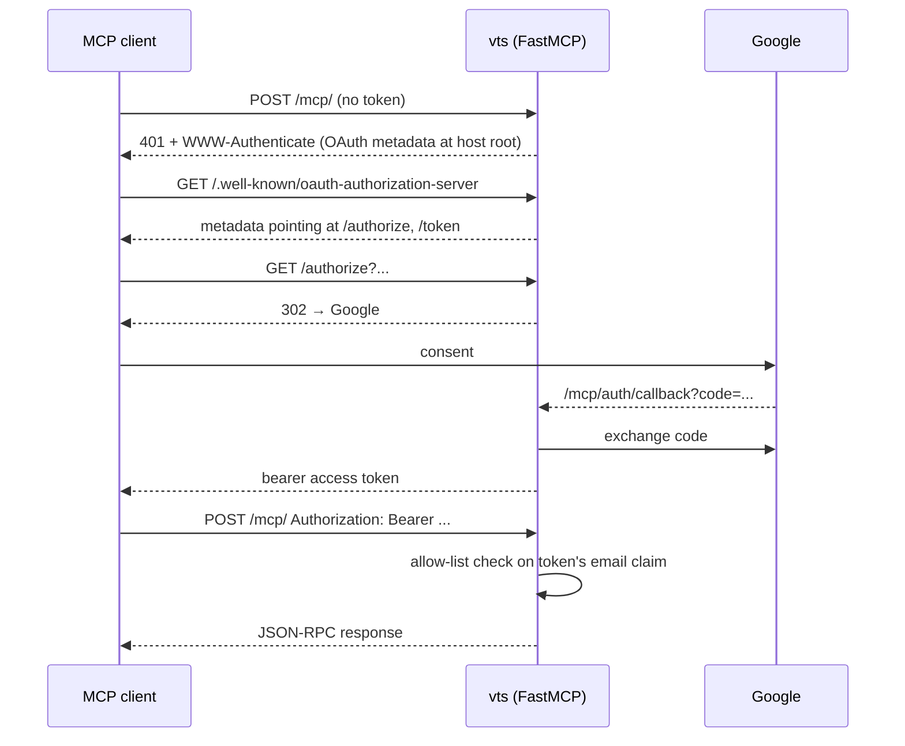

# Authentication

vts authenticates every request through a single resolver,
[`resolve_user_from_request`](../vts/services/auth.py), which picks one of
three branches depending on configuration and request shape:

1. **Browser / web UI** — Google OAuth 2.0 (OIDC) → signed `vts_session`
   cookie → server-side session record in Redis.
2. **MCP clients** (claude.ai, ChatGPT, Claude Desktop) — same Google OAuth
   client, FastMCP-managed bearer tokens. Token claims carry the email.
3. **Dev mode** — `VTS_OAUTH_ENABLED=false` + `X-Forwarded-User` header.
   No proxy CIDR check; intended only for local development.

There is no separate web auth proxy in front of vts; Google is contacted
directly by vts and by FastMCP. Authelia / oauth2-proxy / similar layers
are **not** part of the supported topology.

## Configuration

All keys take `VTS_` env overrides. Defaults match
[`vts/core/config.py`](../vts/core/config.py).

| YAML / setting | Env | Default | Notes |
|----------------|-----|---------|-------|
| `oauth_enabled` | `VTS_OAUTH_ENABLED` | `false` | Master switch. When `false`, X-Forwarded-User is the only path. |
| `oauth_client_id` | `VTS_OAUTH_CLIENT_ID` | `null` | Google OAuth 2.0 Web client ID. |
| `oauth_client_secret` | `VTS_OAUTH_CLIENT_SECRET` | `null` | Required when `oauth_enabled=true`. App fails to start without it. |
| `oauth_allowed_domains` | `VTS_OAUTH_ALLOWED_DOMAINS` | `[]` | Right-hand side of `@`, case-insensitive. |
| `oauth_allowed_emails` | `VTS_OAUTH_ALLOWED_EMAILS` | `[]` | Exact match, case-insensitive. |
| `public_base_url` | `VTS_PUBLIC_BASE_URL` | `null` | e.g. `https://vts.example.com`. Used to build OAuth redirect URIs. |
| `session_secret` | `VTS_SESSION_SECRET` | `null` | HMAC key for the cookie. When unset, autogenerated. |
| `session_secret_file` | `VTS_SESSION_SECRET_FILE` | `/opt/vts/state/session_secret` | Path used for autogeneration. |
| `session_max_age_days` | `VTS_SESSION_MAX_AGE_DAYS` | `30` | Absolute (not sliding) cookie lifetime. |
| `admin.emails` | `VTS_ADMIN_EMAILS` | `[]` | Emails that may impersonate via `?as_user=`. |
| `trusted_proxy.cidrs` | `VTS_TRUSTED_PROXY_CIDRS` | local + RFC1918 | Legacy; only consulted in pre-OAuth code paths. The OAuth resolver does not gate on remote IP. |
| `mcp_enabled` | `VTS_MCP_ENABLED` | `true` | Mounts the FastMCP sub-app at `mcp_path`. |
| `mcp_path` | `VTS_MCP_PATH` | `/mcp` | Where FastMCP is mounted. |

Allow-list semantics: at least one of `oauth_allowed_domains` or
`oauth_allowed_emails` must match. Both empty → access denied (fail-safe).
The allow-list is **re-checked on every request**, not just at login,
so removing someone from the list takes effect on their next call.

Legacy env aliases (`VTS_MCP_OAUTH_*`, `VTS_MCP_OAUTH_BASE_URL`) are still
accepted via [`_mcp_oauth_alias_promotion`](../vts/core/config.py) and map
to the canonical `oauth_*` / `public_base_url` keys. Canonical keys win when
both are set. Plan to remove the aliases in 1.2.x.

## Google client setup

1. In [GCP Console → APIs & Services → Credentials](https://console.cloud.google.com/apis/credentials),
   create an **OAuth 2.0 Client ID** of type **Web application**.
2. Add **both** redirect URIs:
   - `https://<your-domain>/auth/callback` — web UI
   - `https://<your-domain>/mcp/auth/callback` — MCP clients
   (Adjust `/mcp/` if you changed `mcp_path`.)
3. Note the `client_id` and `client_secret`; put them in `vts.env`.
4. Set `VTS_PUBLIC_BASE_URL=https://<your-domain>` (no trailing slash).
5. Populate `VTS_OAUTH_ALLOWED_DOMAINS` (e.g. `your-domain.tld`) and/or
   `VTS_OAUTH_ALLOWED_EMAILS`.

One Google project + one client ID covers both the web UI and MCP — they
share the OAuth allow-list and the same email-derived user identity.

## Browser auth flow



Cookie shape:

- Name: `vts_session`
- Set by Starlette `SessionMiddleware` with
  `https_only=True`, `same_site="lax"`, `max_age=session_max_age_days*86400`
- Signed (not encrypted) with `session_secret`. Payload: `{"sid": "<opaque>"}`.
- The opaque `sid` is the key into a Redis record `{email, issued_at}` with
  matching TTL. See [`vts/services/session_store.py`](../vts/services/session_store.py).

## MCP auth flow



OAuth metadata, `/authorize`, `/token`, `/register`, and `/consent` live at
**host root** (RFC 8414 / 9728), not under `mcp_path`. FastMCP's auth
routes are mounted on the parent FastAPI before the MCP sub-app so they win
path matching. See
[`build_mcp_app_with_wellknown`](../vts/mcp/server.py) and the mount logic
in [`vts/api/main.py`](../vts/api/main.py).

The single resolver handles both paths: if `Authorization: Bearer …` is
present it calls FastMCP's `get_access_token()` and reads the `email`
claim; otherwise it follows the cookie path.

## Logout

`POST /auth/logout` is gated by the
[`require_same_site`](../vts/api/csrf.py) dependency
(Sec-Fetch-Site check). It deletes the Redis sid record so any future call
with the same cookie fails immediately, then clears the cookie state. This
is a **true server-side revocation**, not just a cookie reset — cookies
exfiltrated before logout become useless the moment logout completes.

There is no MCP logout endpoint; revoke MCP access by removing the email
from the allow-list (takes effect on the next request).

## Security model

- **Allow-list re-check on every request.** The resolver re-evaluates the
  email against `oauth_allowed_domains` + `oauth_allowed_emails` on each
  authenticated call, not just at login. Removing someone from the list
  invalidates their next request, no logout required.
- **Sec-Fetch-Site CSRF gate.** All state-changing `/auth/*` endpoints
  (currently `/auth/logout`) require `Sec-Fetch-Site` in
  `{same-origin, same-site, none}`. Missing header → 403. See
  [`require_same_site`](../vts/api/csrf.py).
- **`next` parameter validation.** `_safe_next` in
  [`auth_routes.py`](../vts/api/auth_routes.py) rejects any redirect target
  that is not a relative path starting with a single `/`, including
  backslash-prefixed and percent-encoded variants (`/\evil.com`, `/%2Fevil`,
  `/%5Cevil`) that some browsers normalise into cross-origin redirects.
- **Fail-safe allow-list.** Empty `oauth_allowed_domains` *and* empty
  `oauth_allowed_emails` → all OAuth logins denied. There is no implicit
  "anyone with a Google account" mode.

## Session secret persistence

Self-hosted instances do not need to provide a session HMAC key. On first
start, vts auto-generates one at
[`/opt/vts/state/session_secret`](../vts/api/main.py) (mode 0600, created
via `O_EXCL` so parallel uvicorn workers race-safely). Subsequent restarts
read the existing file.

Override scenarios:

- **HA / multi-host behind a load balancer:** set `VTS_SESSION_SECRET`
  explicitly and share the same value across hosts — autogenerated
  per-host secrets would otherwise produce mismatched cookies.
- **Forced re-login of all users:** delete `/opt/vts/state/session_secret`
  and restart. A new secret is generated and every existing cookie fails
  signature verification.

Back up `session_secret` together with the rest of `vts.env`.

## Session lifetime

`session_max_age_days` (default 30) is the **absolute** cookie lifetime,
not sliding. The cookie expires `N` days after the *most recent successful
login*, regardless of activity in between. To shorten the exposure window
for stolen cookies, lower this value; users will re-authenticate via
Google more often. To eagerly invalidate a single session, call
`POST /auth/logout` (revokes the sid in Redis).

## Admin impersonation

Emails listed in `admin.emails` / `VTS_ADMIN_EMAILS` can switch user
context by adding `?as_user=<email>` to any request. Notes:

- The target user must already exist; otherwise the request returns 404.
  Admins do not auto-create users by impersonating them.
- `as_user` is `.strip().lower()`-normalised so casing variations match
  the stored username (which is also normalised at OAuth callback time).
- Tasks created while impersonating are owned by the target user, not the
  admin.
- Non-admin attempts to use `as_user` return 403.

## Dev mode

For local development without a Google client:

```bash
export VTS_OAUTH_ENABLED=false
curl -H "X-Forwarded-User: alice@example.com" http://localhost:8080/api/me
```

Notes:

- This branch is gated **only** on `oauth_enabled=false`. There is no
  remote-IP / `trusted_proxy_cidrs` check in this path — the assumption is
  that nobody runs `oauth_enabled=false` in production.
- Unknown users are auto-created.
- All other auth behaviour (admin impersonation via `?as_user=`,
  allow-lists, CSRF gate) is bypassed in this mode.

## MCP tools

Tools exposed via the FastMCP endpoint (auth-gated by the bearer flow above):

- `submit_video(url, language?, audio_only?, transcript?, summary?)` —
  submit a URL for processing; returns a `task_id` immediately. Pipeline
  flags mirror the web form: `transcript=True` and `summary=True` by
  default; `audio_only=True` skips video; `language="en"` etc. skips ASR
  autodetect.
- `list_tasks(status?, limit?, sort?, order?)` — list your tasks.
- `get_status(task_id)` — poll status and progress.
- `get_transcript(task_id, variant="raw"|"redacted")` — fetch raw or
  redacted transcript.
- `get_summary(task_id)` — fetch the markdown summary.
- `wait_for_task(task_id, until="done"|"transcript"|"summary", timeout_seconds?)`
  — block until the task reaches the target stage.

## Reverse proxy

Route `Host(<your-domain>)` straight to vts on port 8080. No OIDC
middleware, no path-prefix bypasses, no header injection: vts handles
OAuth, sessions, and bearer tokens itself. The proxy should forward
`Host`, `X-Forwarded-Proto`, and (optionally) `X-Forwarded-For`. Do **not**
forward `X-Forwarded-User` from the public internet when `oauth_enabled=true`
— that header is only consulted in dev mode, but stripping it at the proxy
is a defence in depth.
